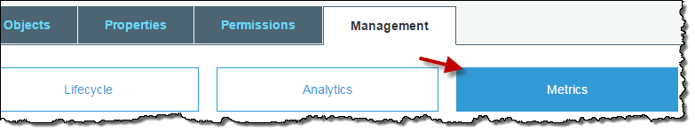
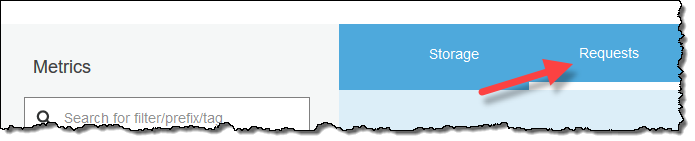
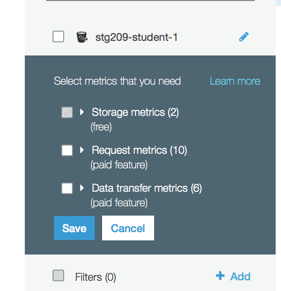
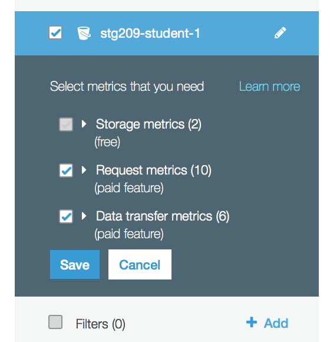

# Amazon S3 - Metrics Configurations for Buckets

## Introduction
This lab demonstrates the use of Amazon S3 Metrics Configurations for Buckets that enables users to recieve 1-minute Cloudwatch metrics, set Cloudwatch alarms and access near-real time Cloudwatch dashboards on operations and performance of Amazon S3.

There are two ways that you can use CloudWatch with Amazon S3. 

* **Daily Storage Metrics for Buckets** - This features provides details on the storage utilization on the bucket level. More speficically, you will be able to get details on the average amount of data stored in a buckets in bytes and total number of objects stored in a bucket. The storage metrics are available for STANDARD storage class, STANDARD_IA storage class, ONEZONE_IA, Reduced Redundancy Storage (RRS) storage class and Glacier (GLACIER) storage class.This feature is turned ON by default and is reported daily with no additional charge.

* **Request metrics** - CloudWatch request metrics for Amazon S3, lets you quickly identify and act on operational issues by providing 1-minute Cloudwatch metrics at the Amazon S3 bucket-level, by default. Cloudwatch request metrics for the objects in a bucket will be available by creating **metric configurations** for a bucket. You can also define a filter for the metrics collected using a shared prefix or object tags, allowing you to align metrics filters to specific business applications, workflows, or internal organizations.
 
For more information about the CloudWatch metrics that are available and the differences between storage and request metrics, see [Monitoring Metrics with Amazon CloudWatch](https://docs.aws.amazon.com/AmazonS3/latest/dev/cloudwatch-monitoring.html).

## Configuring Request Metrics for an S3 Bucket

1. Go to the S3 console, select your S3 bucket
2. Choose the Management tab, and then choose Metrics.

3. Choose Requests

4. From the name of your bucket in the left-side pane, choose the edit icon.

5. Choose the Request metrics check box. This also enables Data Transfer metrics.

6. Choose Save.

You have now created a metrics configuration for all the objects in an Amazon S3 bucket. About 15 minutes after CloudWatch begins tracking these request metrics, you can see graphs for the metrics in both the Amazon S3 or CloudWatch consoles. You can also define a filter so the metrics are only collected and reported on a subset of objects in the bucket. For more information, see How Do I Configure a Request Metrics Filter?.

